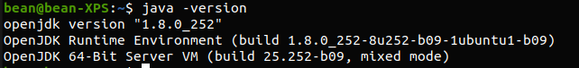

## 一、 前言   
再重新过一遍Java，毕竟这门语言还是用的蛮多的额，虽然...虽然Python很棒，我就是要学，我还要两个混起来搞（ps：不怕出事的小菜鸡）

## 二、准备
&emsp;&emsp;开始搞事情了啊，略略略~~~

1. 安装JDK,配置环境（不会百度吧，这都啥年代了，没通网啊还是咋地）  
    - 安装好了长这样   
    

2. 写个HelloWord.java文件
    ```
    // 务必注意，Python可以不写";",但是Java不可以哦
    public class HelloWord{
        public static void main(String[] args){
            System.out.println("Python最棒！！");
        }
    }
    ```
3. 编译HelloWord.Java文件并运行
    - 使用javac HelloWord.java文件
    - 使用java HelloWord运行

## 三、正文
&emsp;&emsp;没骗你，前面就是准备哦，后面才刚刚开始呢！
1. 标识符（老生常谈了好吧）
    - 所有的标识符都应该以字母（A-Z 或者 a-z）,美元符（$）、或者下划线（_）开始
    - 首字符之后可以是字母（A-Z 或者 a-z）,美元符（$）、下划线（_）或数字的任何字符组合
    - 关键字不能用作标识符
    - 标识符是大小写敏感的
2. 关键字（网上copy的，不要介意哦）
<table class="reference">
<tbody><tr>
<th>类别</th>
<th>关键字</th>
<th>说明</th>
</tr>
<tr>
<td rowspan="4" align="center">访问控制</td>
<td>private</td>
<td>私有的</td>
</tr>
<tr>
<td>protected</td>
<td>受保护的</td>
</tr>
<tr>
<td>public</td>
<td>公共的</td>
</tr>
<tr>
<td>default </td>
<td>默认</td>
</tr>
<tr>
<td rowspan="13" align="center">类、方法和变量修饰符</td>
<td>abstract</td>
<td>声明抽象</td>
</tr>
<tr>
<td>class</td>
<td>类</td>
</tr>
<tr>
<td>extends</td>
<td>扩充,继承</td>
</tr>
<tr>
<td>final</td>
<td>最终值,不可改变的</td>
</tr>
<tr>
<td>implements</td>
<td>实现（接口）</td>
</tr>
<tr>
<td>interface</td>
<td>接口</td>
</tr>
<tr>
<td>native</td>
<td>本地，原生方法（非 Java 实现）</td>
</tr>
<tr>
<td>new</td>
<td>新,创建</td>
</tr>
<tr>
<td>static</td>
<td>静态</td>
</tr>
<tr>
<td>strictfp</td>
<td>严格,精准</td>
</tr>
<tr>
<td>synchronized</td>
<td>线程,同步</td>
</tr>
<tr>
<td>transient</td>
<td>短暂</td>
</tr>
<tr>
<td>volatile</td>
<td>易失</td>
</tr>
<tr>
<td rowspan="12" align="center">程序控制语句</td>
<td>break</td>
<td>跳出循环</td>
</tr>
<tr>
<td>case</td>
<td>定义一个值以供 switch 选择</td>
</tr>
<tr>
<td>continue</td>
<td>继续</td>
</tr>
<tr>
<td>default</td>
<td>默认</td>
</tr>
<tr>
<td>do</td>
<td>运行</td>
</tr>
<tr>
<td>else</td>
<td>否则</td>
</tr>
<tr>
<td>for</td>
<td>循环</td>
</tr>
<tr>
<td>if</td>
<td>如果</td>
</tr>
<tr>
<td>instanceof</td>
<td>实例</td>
</tr>
<tr>
<td>return</td>
<td>返回</td>
</tr>
<tr>
<td>switch</td>
<td>根据值选择执行</td>
</tr>
<tr>
<td>while</td>
<td>循环</td>
</tr>
<tr>
<td rowspan="6" align="center">错误处理</td>
<td>assert</td>
<td>断言表达式是否为真</td>
</tr>
<tr>
<td>catch</td>
<td>捕捉异常</td>
</tr>
<tr>
<td>finally</td>
<td>有没有异常都执行</td>
</tr>
<tr>
<td>throw</td>
<td>抛出一个异常对象</td>
</tr>
<tr>
<td>throws</td>
<td>声明一个异常可能被抛出</td>
</tr>
<tr>
<td>try</td>
<td>捕获异常</td>
</tr>
<tr>
<td rowspan="2" align="center">包相关</td>
<td>import</td>
<td>引入</td>
</tr>
<tr>
<td>package</td>
<td>包</td>
</tr>
<tr>
<td rowspan="8" align="center">基本类型</td>
<td>boolean</td>
<td>布尔型</td>
</tr>
<tr>
<td>byte</td>
<td>字节型</td>
</tr>
<tr>
<td>char</td>
<td>字符型</td>
</tr>
<tr>
<td>double</td>
<td>双精度浮点</td>
</tr>
<tr>
<td>float</td>
<td>单精度浮点</td>
</tr>
<tr>
<td>int</td>
<td>整型</td>
</tr>
<tr>
<td>long</td>
<td>长整型</td>
</tr>
<tr>
<td>short</td>
<td>短整型</td>
</tr>
<tr>
<td rowspan="3" align="center">变量引用</td>
<td>super</td>
<td>父类,超类</td>
</tr>
<tr>
<td>this</td>
<td>本类</td>
</tr>
<tr>
<td>void</td>
<td>无返回值</td>
</tr>
<tr>
<td rowspan="3" align="center">保留关键字</td>
<td>goto</td>
<td>是关键字，但不能使用</td>
</tr>
<tr>
<td>const</td>
<td>是关键字，但不能使用</td>
</tr>
<tr>
<td>null</td>
<td>空</td>
</tr>
</tbody></table>  

## 四、结尾
&emsp;&emsp;关键字很多，不用全记住，后面慢慢就记住了，首先搞好前面的环境搭建和HelloWord吧！关于后面内容将在第二课介绍！（ps:今天太困了）